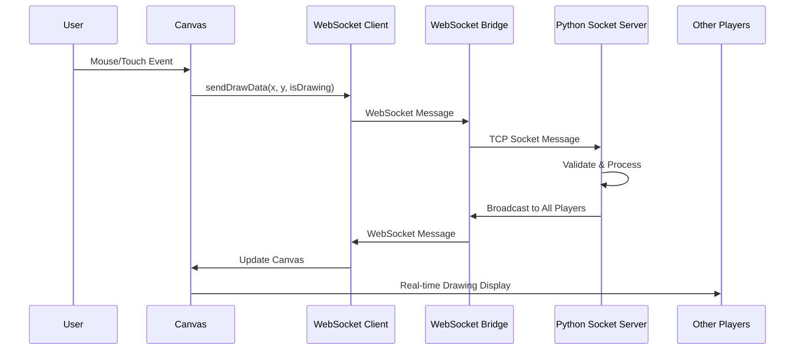
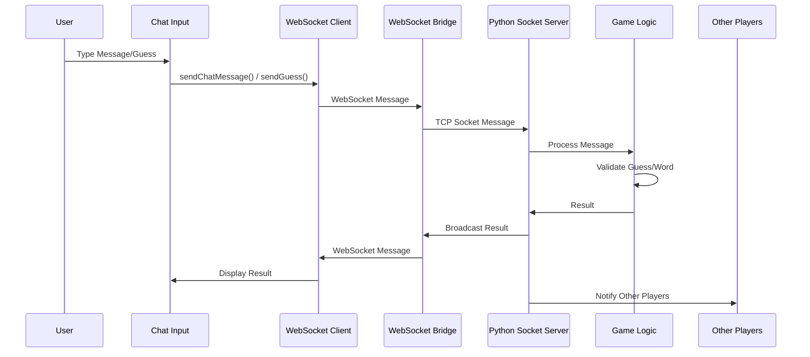
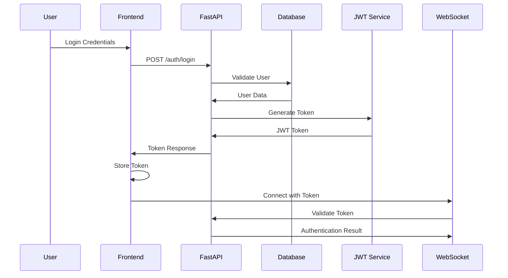
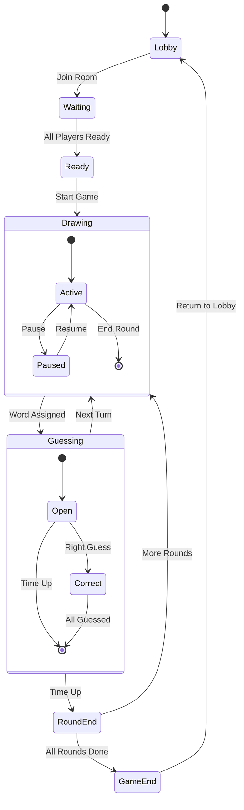
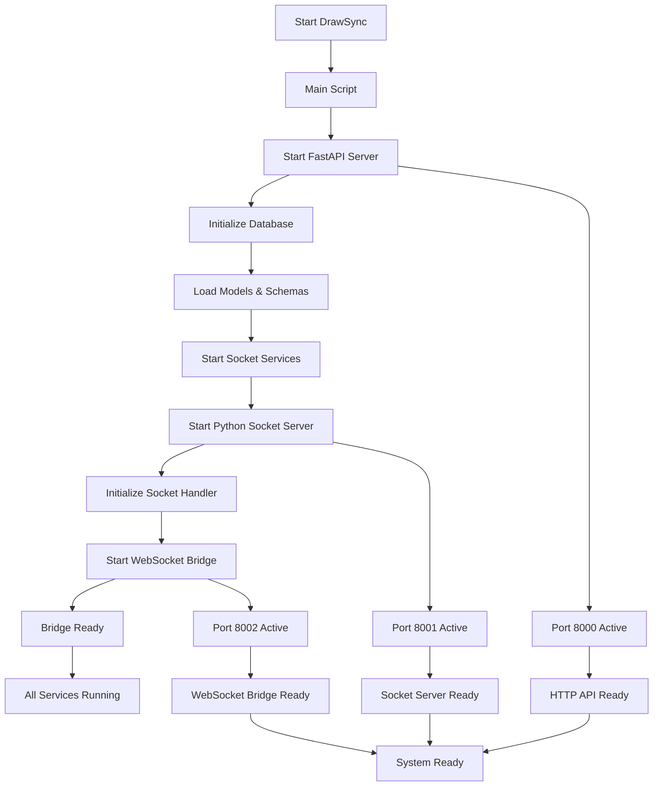
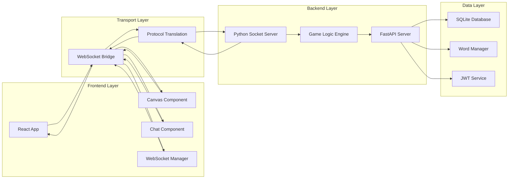
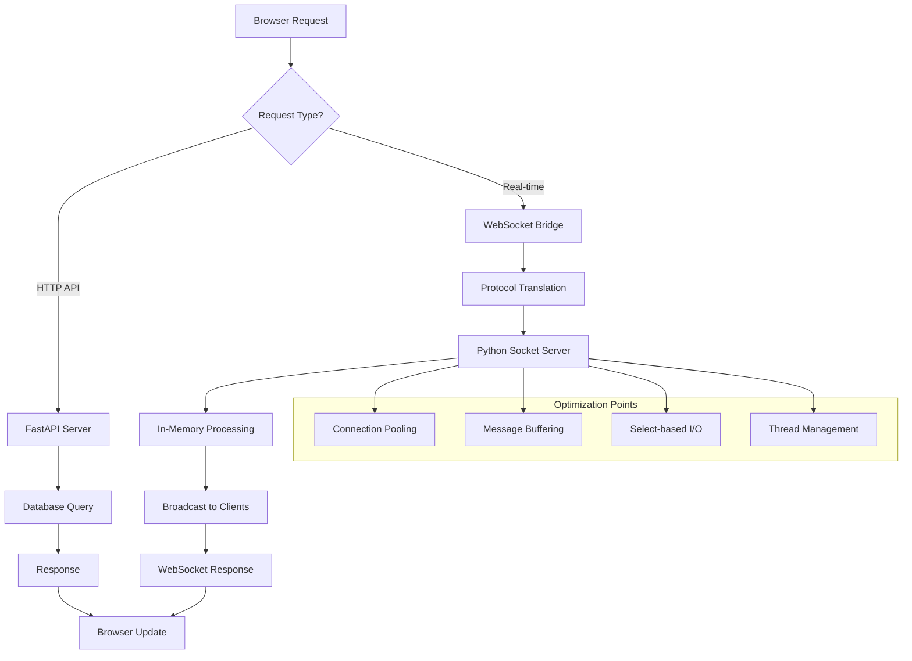
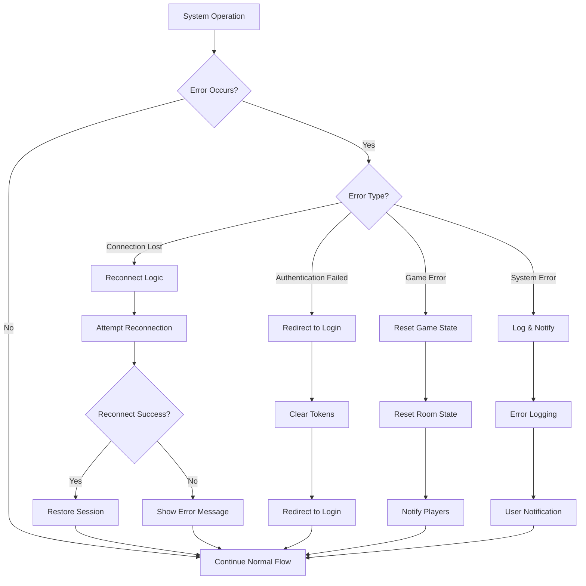

# DrawSync System Flowchart

## 🎯 Complete System Flow

```mermaid
graph TD
    A[User Opens Browser] --> B[React App Loads]
    B --> C{User Authenticated?}
    
    C -->|No| D[Show Login Page]
    D --> E[User Enters Credentials]
    E --> F[FastAPI /auth/login]
    F --> G[Database Validate User]
    G --> H[JWT Token Generated]
    H --> I[Token Stored in Browser]
    I --> J[Redirect to Dashboard]
    
    C -->|Yes| J
    
    J --> K[User Creates/Joins Room]
    K --> L[FastAPI /rooms/]
    L --> M[Database Store Room]
    M --> N[Room ID Returned]
    N --> O[User Joins Game Room]
    
    O --> P[WebSocket Connection]
    P --> Q[WebSocket Bridge Port:8002]
    Q --> R[Python Socket Server Port:8001]
    R --> S[Authenticate with JWT]
    S --> T[Join Room in Socket Server]
    
    T --> U{Game Started?}
    U -->|No| V[Wait for Players]
    V --> W[Player Ready Status]
    W --> X[All Players Ready?]
    X -->|No| V
    X -->|Yes| Y[Start Game]
    
    U -->|Yes| Y
    
    Y --> Z[Assign Word to Drawer]
    Z --> AA[Start Drawing Timer]
    AA --> BB[Player Draws on Canvas]
    BB --> CC[Canvas Event Handler]
    CC --> DD[WebSocket Send Draw Data]
    DD --> EE[Bridge Forward to Socket]
    EE --> FF[Socket Server Process]
    FF --> GG[Broadcast to All Players]
    GG --> HH[Bridge Forward to WebSocket]
    HH --> II[Browser Update Canvas]
    II --> JJ{Time Remaining?}
    JJ -->|Yes| BB
    JJ -->|No| KK[End Round]
    
    KK --> LL[Calculate Scores]
    LL --> MM[Next Player Turn?]
    MM -->|Yes| Z
    MM -->|No| NN[End Game]
    
    NN --> OO[Show Final Scores]
    OO --> PP[Return to Dashboard]
    PP --> K
```

## 🔄 Real-time Drawing Flow

## 💬 Chat & Guessing Flow

## 🔐 Authentication Flow

## 🎮 Game State Management Flow

## 🔧 Service Startup Flow

## 📊 Data Flow Architecture

## 🚀 Performance Optimization Flow

## 🔄 Error Handling Flow

This comprehensive flowchart shows how all the technologies in your DrawSync project work together, from user interaction to real-time communication, authentication, and error handling. The architecture provides a robust foundation for a multiplayer drawing game with optimal performance and reliability. 